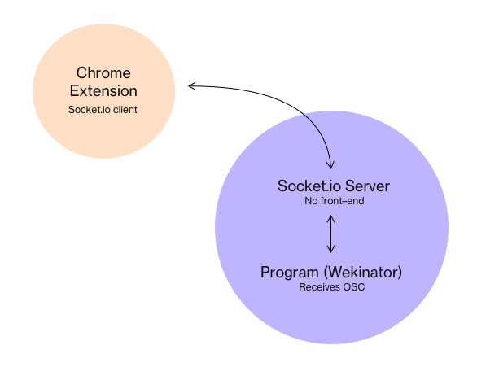

# Raspberry Pi Wekinator Client

Monorepo containing server, wekinator executable and output script. Ongoing work…



## Installation

Clone this repository:

```
$ git clone https://github.com/moritzsalla/REPO_NAME
$ cd REPO_NAME
```

### Pipenv (prefered)

```
$ pip install pipenv
$ cd app/
$ pipenv install
```

### Pip

Make sure you are running `python2.7.13`

To install requirements, run:

```
$ pip install pipenv
$ cd app/
$ pipenv lock --requirements > requirements.txt
$ pip install -r requirements.txt
```

### Docker

Compatibility issues. Might resolve some time later!

```
$ docker build -t sensehat .
$ docker run --privileged --name sensehat -ti sensehat bash
$ python main.py
```

Reference Dockerfile: https://github.com/bmwshop/sensehat

## Running the Flask server

Runs locally. Make sure to connect to the same wifi.

```
$ export FLASK_APP=main.py
$ export FLASK_ENV=development
$ sudo python2 main.py # make sure you are running 2.7
```

Which hostname am I running on?

```
$ hostname -I
```

Example POST request:

```
http://127.0.0.1:8000/items/5?q=somequery
```
